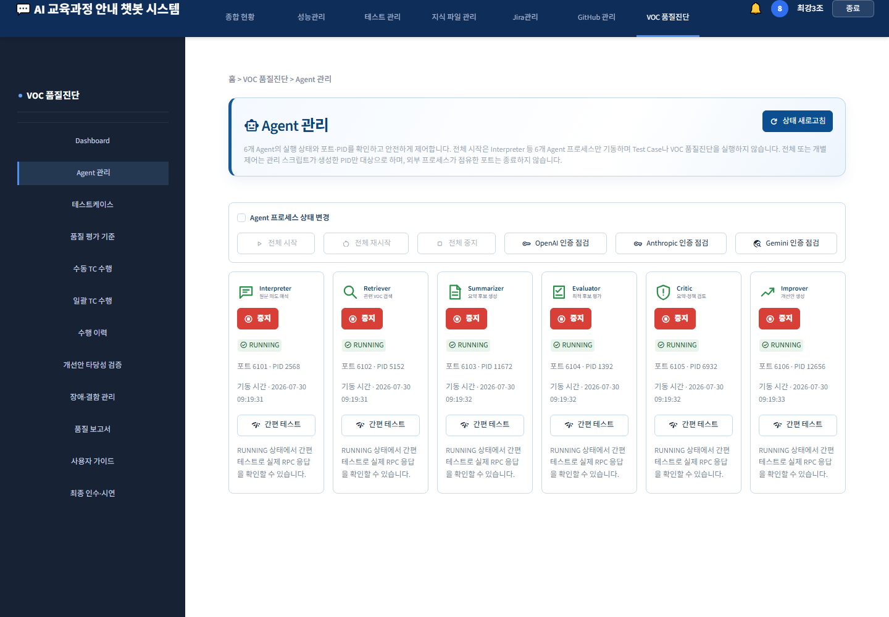
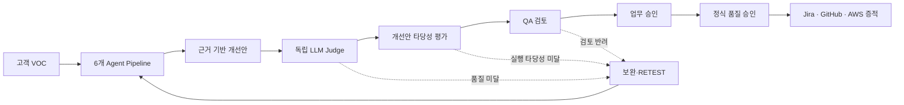
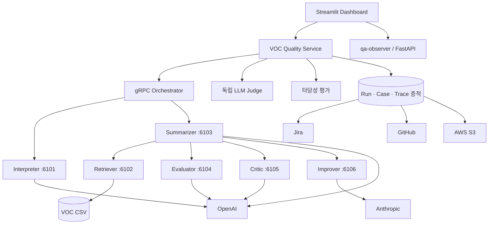

# AI 기반 VOC 개선안 타당성 평가 및 품질 승인 플랫폼

> Multi-Agent Pipeline과 독립 LLM Judge를 활용해 VOC 근거 수집부터 개선안 생성, 실행 타당성 검증, 사람 승인과 운영 증적 보관까지 연결한 AI 품질관리 프로젝트

| 구분 | 내용 |
|---|---|
| 프로젝트 유형 | AI QA · LLMOps · 업무 품질관리 플랫폼 |
| 수행 기간 | 2026.07 ~ 2026.08 |
| 팀 | 최강3조 |
| 작성자 | 이름 입력 |
| 담당 역할 | 담당 범위와 기여도 입력 |
| 기술 | Python, Streamlit, FastAPI, gRPC, OpenAI, Anthropic, Gemini, AWS S3, Jira, GitHub, Pytest |
| 시연 영상 | 영상 링크 입력 |
| 저장소 | GitHub 링크 입력 |

## 1. 한 문장 소개

AI가 그럴듯한 VOC 개선안을 만드는 데서 끝내지 않고, **근거·실행 가능성·측정 지표·위험·책임자를 검증해 실제 운영 가능한 개선안만 승인하는 시스템**입니다.

## 2. 해결하려는 문제

기존 VOC 분석은 불만을 분류하거나 개선안을 생성하는 단계에서 끝나는 경우가 많습니다. 이 방식에는 다음 문제가 있습니다.

- 생성 결과가 실제 VOC 원문과 실행 Trace에 근거했는지 확인하기 어렵습니다.
- 하나의 모델이 생성과 평가를 함께 수행하면 자기평가 편향이 생길 수 있습니다.
- 담당자, 일정, KPI, 적용 범위와 위험이 빠진 개선안도 그럴듯하게 보일 수 있습니다.
- AI 평가가 통과했다는 이유만으로 실제 운영 승인을 내리면 책임 주체가 불명확합니다.
- 실행 결과, 검토 의견과 배포 판정이 여러 도구에 흩어져 감사·재현이 어렵습니다.

이 프로젝트는 이 문제를 **다단계 평가와 증적 중심의 승인 프로세스**로 해결했습니다.

## 3. 핵심 해결 방식

핵심은 독립 Judge와 사람 승인 사이에 **개선안 타당성 평가 Gate**를 둔 것입니다. 품질 점수가 높더라도 담당·일정·KPI·위험 관리가 부족하면 운영 승인으로 넘어갈 수 없습니다.

## 4. 주요 기능

| 기능 | 구현 내용 | 품질 효과 |
|---|---|---|
| 6개 Agent Pipeline | Interpreter, Retriever, Summarizer, Evaluator, Critic, Improver를 gRPC로 연결 | 역할별 책임 분리와 처리 과정 추적 |
| 독립 LLM Judge | Pipeline 내부 평가와 분리된 Provider·모델로 100점 Rubric 평가 | 자기평가 편향 완화 |
| 개선안 타당성 평가 | 근거성, 구체성, 실행 가능성, KPI, 위험을 서버 기준으로 재계산 | 실행 가능한 개선안만 선별 |
| 초안작성 마법사 | Run·Case·Trace를 기반으로 담당·일정·근거·KPI·위험 초안 작성 | 검토 입력 누락과 작성 부담 감소 |
| 순차 승인 | `AI_PASS → QA_REVIEWED → BUSINESS_APPROVED` 상태 전이 | 자동 평가와 운영 책임 분리 |
| 수행 이력·A2A Trace | Run·Case·Agent 호출·Judge·타당성 결과를 연결 저장 | 결과 재현과 감사 가능성 확보 |
| 결함·RETEST 관리 | 원본 Run과 재시험을 연결하고 상태 전이를 제한 | 임의 종료·잘못된 개선 주장 방지 |
| 품질 보고서·최종 인수 | 정량 수치, 잔여 위험, Gate 판정과 증적 생성 | 기능 완료와 배포 가능 상태 구분 |
| 외부 연동 | Jira 이슈, GitHub 형상관리, AWS S3 최종 인수 증적 | 분석 결과를 실제 업무와 보관 체계로 연결 |

## 5. 시스템 아키텍처

### Agent별 책임

| Agent | 포트 | 책임 |
|---|---:|---|
| Interpreter | 6101 | 질문 의도, 키워드와 검색 조건 해석 |
| Retriever | 6102 | VOC 데이터 검색과 원문 근거 보존 |
| Summarizer | 6103 | Pipeline 오케스트레이션과 사실 기반 요약 |
| Evaluator | 6104 | 복수 요약 후보의 상대 평가 |
| Critic | 6105 | 누락·모순·위험 탐지와 수정 지침 생성 |
| Improver | 6106 | 담당·일정·KPI가 포함된 정책 개선안 생성 |

## 6. 가장 큰 차별점: 개선안 타당성 평가

독립 Judge가 답변의 전반적인 품질을 평가한다면, 타당성 평가는 **그 개선안을 실제로 실행해도 되는가**를 판단합니다.

| 평가 차원 | 배점 | 통과 하한 |
|---|---:|---:|
| 불만 원인과 개선안 연결 | 22 | 16 |
| VOC·Trace 근거 추적성 | 22 | 14 |
| 업무·기술 실행 가능성 | 18 | 13 |
| 담당·일정·KPI 구체성 | 13 | 9 |
| 위험·보안·규제 고려 | 25 | 13 |
| 합계 | 100 | 80점 이상 |

모델이 반환한 총점과 판정을 그대로 신뢰하지 않고 서버가 차원별 점수로 다시 계산합니다. 총점이 높아도 다음 조건이 발견되면 즉시 승인을 보류합니다.

- VOC 또는 Trace 근거 누락
- 안전하지 않거나 규정에 맞지 않는 조치
- 미종결 High·Critical 결함
- 독립 Judge 미실행·오류·비통과
- 기준 답변 대비 안전성 하락

## 7. 설계하면서 중요하게 판단한 것

### 7.1 생성과 평가의 독립성

Pipeline 내부 Evaluator·Critic과 최종 독립 Judge를 분리했습니다. Provider 조합과 독립성 등급을 기록해 같은 계열 모델의 자기평가 위험을 화면에서 확인할 수 있게 했습니다.

### 7.2 성공처럼 보이는 실패를 만들지 않기

`PASS`, `REVIEW_REQUIRED`, `ERROR`, `NOT_RUN`을 분리했습니다. Agent 장애, API 인증 오류, 빈 검색 결과와 Judge 오류가 Pipeline 성공으로 덮이지 않도록 상태 모델을 구성했습니다.

### 7.3 AI 승인과 운영 승인의 분리

`AI_PASS`는 자동 평가 통과일 뿐입니다. QA 검토와 업무 승인을 순서대로 기록해야 `FORMAL_QUALITY_APPROVED`가 됩니다. 각 검토는 담당자, 시각, 의견과 이전·다음 상태를 append-only 감사 이력으로 남깁니다.

### 7.4 증적 우선 설계

결과 화면뿐 아니라 Run ID, Case ID, Trace ID, Rubric 버전·해시, Provider·모델, 평가 근거와 승인 이력을 파일 증적으로 저장했습니다. 최종 인수 파일은 허용된 JSON·Markdown만 AWS S3에 업로드하고 원격 SHA-256으로 다시 검증합니다.

## 8. 대표 시연 결과

2026-08-04 최종 녹화에서 TC-01 한 건의 전체 승인 흐름을 실제로 수행했습니다.

| 항목 | 결과 |
|---|---|
| Run ID | `RUN-20260804-132006-496046-e9c0` |
| Pipeline | `PASS` · 오류 0건 |
| 독립 Judge | `PASS` · 96점 · 독립성 A |
| 개선안 타당성 | `AI_PASS` · 81점 · 즉시 보류 0건 |
| QA 검토 | `QA_REVIEWED` 완료 |
| 업무 승인 | `BUSINESS_APPROVED` 완료 |
| 대표 Case 배포 판정 | `FORMAL_QUALITY_APPROVED` |
| AWS 증적 | JSON·Markdown 2개 업로드 및 원격 SHA-256 검증 |

### 결과를 해석할 때의 주의점

위 결과는 **대표 Case 한 건의 E2E 승인 시연 결과**입니다. 프로젝트의 35건 최종 운영 인수 Gate는 별도 기준이며, 기존 35건 Run은 4 PASS / 6 HOLD 상태입니다. 포트폴리오에서는 이를 35건 전체 배포 승인으로 확대 해석하지 않습니다.

이 구분은 프로젝트의 강점입니다. 기능이 동작한다는 사실과 전체 운영 품질이 승인됐다는 주장을 분리하고, 미실행·미검증·잔여 위험을 그대로 표시했습니다.

## 9. 검증 전략

- 정상·모호·복합·데이터 없음·오타·장애 Case를 분리한 품질진단
- Retriever 중단, 포트 충돌, CSV 누락, 인증 오류, 지연, 빈 검색 장애시험
- Rubric 경계값, 항목별 하한, 즉시 보류 규칙과 서버 재계산 검증
- 업무 선승인 차단과 QA → 업무 순차 승인 검증
- Run·Case·Judge·타당성·보고서 증적 무결성 검사
- Streamlit 화면 테스트와 Python 서비스 회귀 테스트

Step 10 기준 자동 회귀는 **229 PASS**였으며, 기존 qa-observer Prometheus 집계 문제 6건은 통과로 숨기지 않고 잔여 결함으로 분리했습니다.

## 10. 외부 시스템 연동

| 연동 | 제공 기능 | 안전 원칙 |
|---|---|---|
| Jira | JQL 조회, 신규 이슈 등록, 앱 등록 이력 | 사용자의 명시적 등록 동작에서만 외부 변경 |
| GitHub | 저장소·브랜치·커밋 상태, 저장·다운로드·ZIP, 충돌 사전 점검 | 자동 Push 금지, 원격 변경 전 상태 확인 |
| AWS S3 | 최종 인수 증적 업로드, 매니페스트와 파일 정보 확인 | 허용 파일 2개, 비밀값 탐지, AES256, 원격 해시 검증 |

## 11. 기술 스택

| 영역 | 기술 |
|---|---|
| Frontend | Streamlit 1.59.2, Pandas, Altair |
| Backend | Python 3.12, FastAPI, Uvicorn |
| Agent 통신 | gRPC, Protobuf 6 |
| LLM | OpenAI, Anthropic Claude, Google Gemini |
| 품질관리 | Pytest, JSON Schema, Rubric 기반 서버 판정 |
| Observability | qa-observer, Prometheus API, 구조화 이벤트 |
| Integrations | Jira, GitHub, AWS CLI·S3 |
| 문서·증적 | JSON, Markdown, TXT, JUnit XML, HTML, PDF/DOCX 지원 |

## 12. 프로젝트를 통해 얻은 것

- LLM 품질은 한 번의 점수보다 **역할 분리, 독립 평가, 실패 상태와 증적**으로 관리해야 한다는 점을 확인했습니다.
- 높은 답변 품질과 업무 실행 가능성은 다른 문제이며, 타당성 Gate가 두 영역을 연결합니다.
- 자동화는 사람 승인을 대체하기보다 검토 근거를 구조화하고 누락을 줄일 때 더 안전합니다.
- 성공 결과뿐 아니라 HOLD와 잔여 위험을 설명할 수 있어야 품질 시스템을 신뢰할 수 있습니다.

## 13. 향후 개선 계획

- 동일 조건의 35건 최종 Run을 완성해 전체 운영 인수 Gate 검증
- 기존 qa-observer Prometheus 집계 결함 6건 해소
- 장기 평가 데이터 기반 Rubric 임계값 보정과 품질 추세 분석
- 역할 기반 접근 제어와 승인자 조직 계정 연동
- S3 증적 조회의 원격 메타데이터 기반 이력화와 보존 정책 자동 점검

## 14. 30초 소개 문구

> 이 프로젝트는 고객 VOC를 분석해 개선안을 만드는 데서 끝나지 않고, 그 개선안이 실제로 실행 가능한지 검증하는 AI 품질관리 플랫폼입니다. 6개 Agent가 VOC 근거를 수집하고 개선안을 생성한 뒤, 독립 LLM Judge와 타당성 평가가 품질·담당·일정·KPI·위험을 검증합니다. 마지막으로 QA와 업무 승인을 분리하고 모든 판단을 Run과 Trace 증적으로 남겨, 그럴듯한 답변이 아니라 실행하고 측정하며 책임질 수 있는 개선안만 운영으로 연결했습니다.

## 15. 제출 전 개인화 체크리스트

- [ ] 작성자 이름과 개인 담당 역할·기여도를 입력했습니다.
- [ ] GitHub 저장소와 시연 영상 링크를 입력했습니다.
- [ ] 공개 저장소에서 `.env`, 토큰, 개인정보가 제외됐는지 확인했습니다.
- [ ] 본인이 직접 설명할 수 있는 기술과 의사결정만 남겼습니다.
- [ ] 팀 성과와 개인 기여를 명확히 구분했습니다.
- [ ] 1건 시연 승인과 35건 전체 인수 Gate를 혼동하지 않았습니다.

---

발표용 12장 구성과 슬라이드별 멘트는 [포트폴리오 발표 구성안](docs/portfolio/VOC_AI_QUALITY_PORTFOLIO_SLIDES.md)에서 확인할 수 있습니다.
