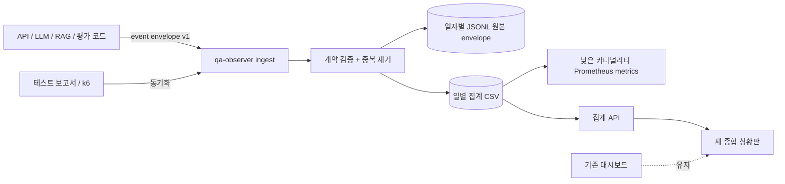

# Task 2 이벤트·저장소·보안 설계서

- 상태: `APPROVED`
- 승인 시각: `2026-07-14`
- 계약 버전: `v1`
- 이벤트 계약: `contracts/qa_observer/event-envelope-v1.schema.json`
- 집계 CSV header: `contracts/qa_observer/daily-aggregates-v1.header.csv`
- 향후 SQLite 확장 DDL: `contracts/qa_observer/sqlite-v1.sql`
- 기준 시간대: 저장은 UTC, 화면 표시는 Asia/Seoul

## 1. 목표와 범위

`qa-observer`가 API, LLM, RAG, 품질 평가, 테스트 실행, 안전성, 결함, 수집기 상태를 하나의 계약으로 수신·동기화하고 JSONL 상세 이벤트와 CSV 집계로 분리 저장할 수 있게 한다.

Task 2에서는 계약과 정책만 확정한다. 이벤트를 실제 발생시키는 코드 변경은 Task 3~4, 집계 API와 Prometheus 연결은 Task 5에서 수행한다.

## 2. 승인된 전제

- MVP 저장소는 일자별 JSONL 이벤트 로그와 일별 집계 CSV로 시작한다.
- 데이터량이나 동시 조회 요구가 커질 때 저장소 인터페이스를 유지한 채 SQLite로 확장한다.
- 일 API 비용 예산은 50,000 KRW다.
- 프롬프트·응답·질문·검색 문서 원문은 기본 저장하지 않는다.
- 기존 Streamlit 대시보드는 유지한다.
- 새 종합 상황판은 기존 메뉴·기능을 삭제하지 않고 별도 화면으로 추가한다.

## 3. 이벤트 처리 흐름



## 4. 공통 이벤트 envelope

모든 이벤트는 아래 공통 필드를 가진다.

| 필드 | 필수 | 설명 |
|---|---:|---|
| `event_id` | 예 | 발행자가 생성한 UUID. 재전송할 때 같은 값을 사용한다. |
| `event_type` | 예 | v1에서 허용한 8개 이벤트 유형 |
| `schema_version` | 예 | 현재 `1` |
| `occurred_at` | 예 | 원천에서 실제 발생한 UTC ISO-8601 시각 |
| `source.component` | 예 | `api`, `judge_agent`, `rag`, `test_report_sync` 등 |
| `source.instance` | 아니요 | 프로세스·컨테이너 instance. 상세 DB 전용 |
| `context.environment` | 예 | local, dev, stage, prod |
| `context.service` | 예 | 서비스 필터용 안정적인 이름 |
| `context.trace_id` | 아니요 | W3C 형식 32자리 hex. 상세 추적 전용 |
| `context.run_id` | 아니요 | 테스트 실행 연결. 상세 DB 전용 |
| `context.case_id` | 아니요 | 테스트 케이스 연결. 상세 DB 전용 |
| `dedup_key` | 예 | 원천의 안정 키로 만든 중복 제거 키 |
| `payload` | 예 | 이벤트 유형별 필드 |

`received_at_utc`는 신뢰할 수 없는 발행자 값이 아니라 qa-observer가 수신 시 생성한다.

## 5. 이벤트 유형

| 이벤트 유형 | 생성 지점 | 핵심 데이터 | 사용 KPI |
|---|---|---|---|
| `api.request.completed` | FastAPI middleware | route template, status, timeout, duration | 요청량, 오류율, p95 |
| `llm.call.completed` | 공급자 wrapper | 실제 usage, provider, model, latency, cost | 토큰, 비용, LLM 지연 |
| `rag.search.completed` | RAG 검색 함수 | Top-K, 결과 수, hit, latency, fingerprint | RAG 성공률·적중률 |
| `quality.evaluation.completed` | Rule/Judge 평가 | decision, metric scores, evaluated 여부 | 품질점수, 안전성 |
| `test.run.completed` | 실행 종료·보고서 sync | PASS/FAIL/ERROR, 기준 단계 | 테스트 통과율 |
| `safety.violation.detected` | 안전성 판정 | category, severity, action, blocked | 안전성 위반 |
| `defect.changed` | 결함 생성·Jira sync | 유형, 심각도, 상태, 외부 key | 최근 결함·조치 |
| `collector.sync.completed` | qa-observer scheduler | source, 처리 수, 상태, checkpoint | 데이터 신선도 |

## 6. 식별자와 중복 제거

- `event_id`: UUID4를 사용한다. 발행자가 재시도할 때 새 UUID를 만들지 않는다.
- `dedup_key`: `source + 원천 안정 ID + event_type + schema_version`을 정규화한 뒤 SHA-256으로 만든다.
- 테스트 보고서: `run_id + case_id + evaluator_type + report fingerprint`를 기준으로 한다.
- API 요청: trace/span 식별자가 있으면 사용하고, 없으면 middleware가 요청 UUID를 만든다.
- LLM 호출: 공급자 request ID가 있으면 결합하되 Prometheus label에는 넣지 않는다.
- DB는 `event_id` primary key와 `dedup_key` unique 제약으로 재수집을 멱등 처리한다.
- 같은 키와 다른 payload가 들어오면 덮어쓰지 않고 충돌 오류와 수집기 경고를 기록한다.

## 7. MVP 파일 저장 모델

```text
data/qa_observer/
├── events/<event_type>/YYYY-MM-DD.jsonl
├── aggregates/daily-aggregates.csv
└── state/collector-checkpoints.json

logs/qa_observer/
└── qa-observer.log
```

설계 원칙:

- 검증된 envelope는 이벤트 유형·발생 UTC 일자별 JSONL에 한 줄씩 append하고 flush한다.
- 시작 시 보존 기간 내 JSONL을 읽어 `event_id`와 `dedup_key` index를 재구성한다.
- CSV는 `date + environment + service + provider + model + metric`을 key로 합계·표본 수·최소·최대를 관리한다.
- CSV는 임시 파일 작성 후 원자적 교체로 손상을 방지한다.
- 품질 metric은 metric 이름을 행으로 저장해 `relevance`, `trust`를 header 변경 없이 추가한다.
- 비용은 부동소수 오차를 피하기 위해 `micro KRW` 정수로 저장한다. 1 KRW는 1,000,000 micro KRW다.
- 호출 당시 단가·환율 식별자는 event payload에 기록해 과거 비용을 재현한다.
- qa-observer 한 프로세스만 파일 writer가 되고 집계 API는 snapshot을 읽는다.
- `data/qa_observer`와 `logs/qa_observer`는 프로젝트 소스 백업 ZIP에 포함하지 않는다.

일별 집계 CSV header:

```text
date,environment,service,provider,model,metric,sum_value,sample_count,min_value,max_value,updated_at_utc
```

향후 SQLite 확장:

- `contracts/qa_observer/sqlite-v1.sql`은 미래 마이그레이션 계약으로만 보존한다.
- JSONL backfill 검증, row count·KPI 동등성 검증, 사용자 승인을 거쳐야 적용한다.
- 현재 Task 3~6에서는 SQLite 파일을 생성하지 않는다.

## 8. 기존 데이터 매핑

| 현재 원천 | v1 대상 | 변환 규칙·공백 |
|---|---|---|
| `run_manifest.json` | `test_runs`, `test.run.completed` | 기존 local 시각을 Asia/Seoul로 해석 후 UTC 변환 |
| `evaluation_result.json/csv` | `test_case_results`, `quality_evaluations` | PASS/REVIEW/FAIL 유지, 동기화 오류는 ERROR로 구분 |
| `dashboard_snapshot.json` | 초기 backfill 참고 | 추정 토큰·비용은 공식 usage로 이관하지 않음 |
| `judge_agent.py` | `llm.call.completed` | Task 4에서 `completion.usage`와 provider request ID 계측 필요 |
| `knowledge_base.py` | `rag.search.completed` | 원문 text·filename 대신 HMAC fingerprint와 rank 저장 |
| FastAPI `/metrics` | `api.request.completed` + Prometheus | 현재 raw path를 route template으로 변경, 4xx 별도 집계 |
| k6 summary | 성능 실행 동기화 | run metadata와 대상 service 연결 필요 |
| Jira 기능 | `defect.changed`, `defects` | 외부 issue key만 저장, 설명 원문은 Jira에 유지 |

## 9. 개인정보·민감정보 정책

저장 금지:

- 프롬프트, 사용자 질문, LLM 응답, 검색 chunk text
- 이름, 이메일, 전화번호, 사용자 ID, 세션 cookie
- API key, access token, Authorization header
- 전체 URL query string과 동적 식별자가 포함된 raw path

저장 허용:

- 문자 길이, 실제 token usage, 소요시간, 상태와 오류 유형
- 고정된 route template
- provider, model, service, environment
- HMAC-SHA256 fingerprint와 fingerprint key version

fingerprint 규칙:

- 일반 SHA-256 대신 비밀 key를 사용하는 HMAC-SHA256을 사용한다.
- 표현 형식은 `hmac-sha256:v1:<64 hex>`다.
- HMAC key는 `.env` 또는 secret manager에서 읽고 DB·로그·백업에 기록하지 않는다.
- key가 없으면 원문 fingerprint를 만들지 않고 `null`로 저장하며 평문 hash로 대체하지 않는다.
- key rotation 후에는 새 version을 사용하며 과거 fingerprint를 재작성하지 않는다.

MVP 파일은 원문 미저장과 OS 파일 ACL로 보호한다. 운영 전환 시 암호화 disk 또는 SQLite/PostgreSQL의 암호화 저장소를 적용한다.

## 10. Prometheus 분리 기준

허용 label:

- `environment`, `service`, `provider`, `model`, `operation`
- `status`, `status_class`, `error_type`, `stage`, `severity`, `metric`

금지 label:

- `event_id`, `trace_id`, `run_id`, `case_id`, request/provider ID
- 질문·응답·프롬프트·사용자·문서·chunk fingerprint
- raw URL/path, 오류 message

예정 metric:

```text
qa_api_requests_total{environment,service,route,status_class}
qa_api_request_duration_seconds_bucket{environment,service,route}
qa_llm_requests_total{environment,service,provider,model,operation,status}
qa_llm_tokens_total{environment,service,provider,model,operation,type}
qa_llm_cost_krw_total{environment,service,provider,model,operation}
qa_llm_duration_seconds_bucket{environment,service,provider,model,operation}
qa_rag_searches_total{environment,service,status}
qa_rag_duration_seconds_bucket{environment,service}
qa_quality_score{environment,service,evaluator,metric}
qa_safety_violations_total{environment,service,severity,category}
qa_collector_last_success_timestamp_seconds{source}
```

`route`, `category`, `error_type`은 사전 허용 목록으로 정규화하고 알 수 없는 값은 `other`로 묶는다.

## 11. 보존 및 삭제 정책 초안

| 데이터 분류 | 보존 기간 | 삭제 전 조건 |
|---|---:|---|
| API·LLM·RAG JSONL 상세 이벤트 | 90일 | 일별 CSV 집계 완료 |
| 수집기 실행 이벤트 | 30일 | 마지막 성공·오류 checkpoint 유지 |
| 테스트·품질 결과 | 365일 | 실행별 요약 집계 유지 |
| 안전성 위반 metadata | 365일 | 결함 연결과 처리 상태 확인 |
| 결함 | 730일 | 외부 issue와 상태 동기화 완료 |
| 단가·환율 snapshot | 1,095일 | 참조하는 usage가 없어야 함 |
| 일별 KPI 집계 | 730일 | 월별 장기 추세 집계 가능 |
| Prometheus 시계열 | MVP 30일 | Grafana/운영 요구에 따라 조정 |

삭제 작업은 매일 새벽 03:30 KST에 qa-observer scheduler가 수행한다. 삭제 수와 실패 상태를 자체 metric과 collector event로 남긴다. 일자별 JSONL 파일을 삭제하고 CSV에서는 보존 기간을 지난 행을 원자적으로 제거한다.

## 12. 시간·단위 규칙

- 이벤트·DB: UTC ISO-8601 (`Z`) 저장
- 화면: Asia/Seoul 변환 표시
- duration: 이벤트·DB는 정수 millisecond, Prometheus histogram은 second
- 비율: DB/API는 0~100, Prometheus 계산용 counter는 원시 count
- 비용: DB는 micro KRW 정수, API는 KRW decimal, 화면은 원 단위 반올림
- token: 공급자 usage의 정수값. 추정 token은 별도 `estimated` 상태 없이는 저장하지 않음

## 13. 장애와 재처리

- 계약 오류: HTTP 422, 원문을 로그에 남기지 않고 field path와 error code만 기록한다.
- 중복 이벤트: 같은 payload면 HTTP 200과 `duplicate=true`, 다른 payload면 409 conflict다.
- 파일 잠김·I/O 오류: 최대 3회 지수 backoff 후 수집 실패 metric을 남긴다.
- Prometheus 노출 실패가 JSONL 저장을 롤백하지 않는다.
- 보고서 sync는 checkpoint를 성공 후에만 전진시킨다.
- 손상된 보고서 하나가 전체 동기화를 중단하지 않도록 파일별 격리한다.

## 14. Task 2 검증 기준

- JSON Schema가 유효한 JSON이며 8개 이벤트 유형을 정의한다.
- JSONL append·재시작 후 dedup index 재구성이 검증된다.
- CSV header와 집계 key, 원자적 교체가 검증된다.
- raw prompt/question/response/chunk text field가 계약에서 거절된다.
- 향후 SQLite DDL은 migration 가능성 검증을 위해 in-memory 적용 테스트만 유지한다.
- 기존 manifest·평가·LLM·RAG·API 원천이 대상 table에 매핑된다.

## 15. 사용자 확인 항목

1. 상세 이벤트는 일자별 JSONL, 집계는 CSV, checkpoint는 작은 JSON 파일로 시작한다. `사용자 변경 승인`
2. 공통 envelope를 JSONL로 보존하고 대시보드용 metric을 CSV 행으로 projection한다. `변경 승인`
3. 원문은 저장하지 않고 HMAC fingerprint·길이·token metadata만 저장한다. `권장: 승인`
4. 11절의 보존 기간을 적용한다. `권장: 승인`
5. 로컬 파일은 원문 미저장과 OS ACL로 보호하고 운영 전환 시 저장소 암호화를 적용한다. `권장: 승인`
6. UTC 저장·Asia/Seoul 표시, duration millisecond, 비용 micro KRW 단위를 적용한다. `권장: 승인`

Task 2 승인 및 파일 저장 방식 변경 완료. Task 3 `qa-observer` 서비스 구현을 시작한다.

## 16. 현재 검증 결과

- JSON Schema meta 검증: PASS
- 8개 이벤트 payload 유효성 검증: PASS
- raw `prompt` 추가 필드 거절: PASS
- 향후 SQLite v1 DDL in-memory 적용: PASS
- 필수 table 15개, retention 분류 7개 생성: PASS
- foreign key 검사: PASS
- 중복 `dedup_key` 거절: PASS
- 1~5 범위를 벗어난 품질점수 거절: PASS
- 계약 전용 테스트: 2 PASS
- 전체 프로젝트 테스트: 89 PASS, 기존 Starlette deprecation warning 1건
- Task 2 시작 전 백업과 비교한 기존 `dashboard/` 41개 파일: 변경 없음

- Task 2 권장안 1~6과 보존 기간: 사용자 승인
- 사용자 변경: SQLite MVP 대신 JSONL·CSV·local log를 사용하고 SQLite는 향후 확장
